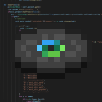

# RECORD API

Endless amount of music discs!
## Navigation
- [app](app/README.md)
- [example](example/README.md)

## Pack Data

| Key                | Value    |
|--------------------|----------|
| namespace          | `record` |
| pack_version       | `1.2.0`  |
| mc_version         | `1.20.2` (23w23a) |
| multiplayer_tested | `no`     |
| has_config         | `no`     |

## LINKS
- [Download](https://www.curseforge.com/minecraft/customization/record-api-datapack)
- [Wiki Page](https://github.com/legopitstop/Record_API/wiki)
- [License](https://legopitstop.weebly.com/legopitstops-common-license-v2.html)
- [Bug Report](https://github.com/legopitstop/Record_API/issues)